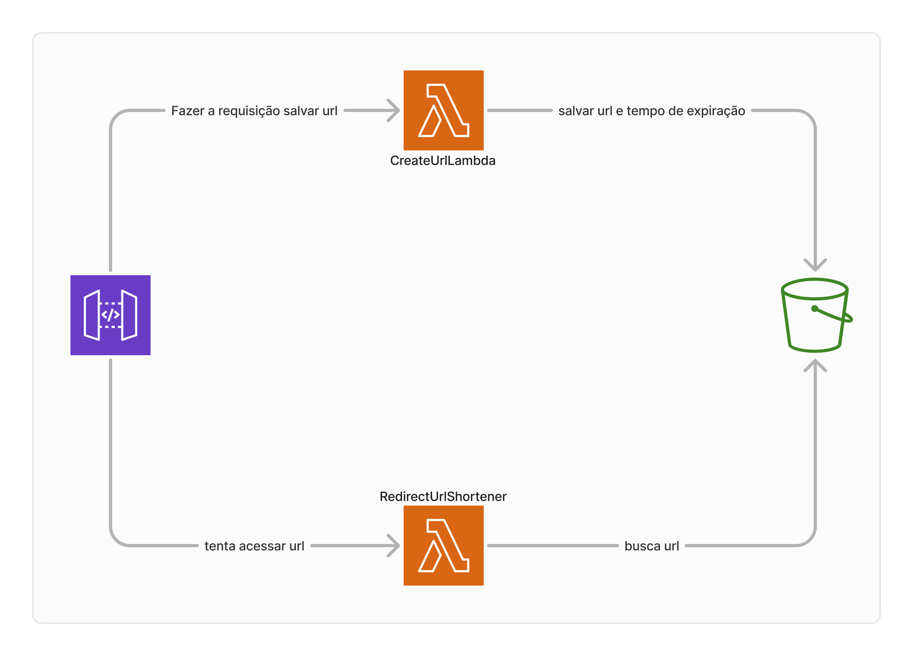

# Encurtador de URL

Este projeto é um encurtador de URL serverless desenvolvido com **AWS Lambda**, **S3** e **API Gateway**. Ele permite criar URLs encurtadas e gerenciar seu tempo de expiração.

## **Funcionalidades**
- **Encurtar URLs**: Gera um código único para uma URL fornecida.
- **Gerenciamento de Expiração**: URLs podem expirar após um tempo determinado.
- **Redirecionamento**: URLs encurtadas redirecionam automaticamente para o endereço original.
- **Arquitetura Serverless**: Utiliza serviços da AWS para alta escalabilidade e baixo custo.



## **Arquitetura**

1. **AWS Lambda**: 
   - Processa as requisições para criação e consulta de URLs encurtadas.
2. **S3**:
   - Armazena metadados sobre as URLs encurtadas em formato JSON.
3. **API Gateway**:
   - Expõe as funções Lambda como APIs REST para uso público.

## **Endpoints**

### **1. Criar URL Encurtada**
- **Método**: `POST`  
- **Endpoint**: `/create`
- **Corpo**:  
  ```json
  { "originalUrl": "https://exemplo.com", "expirationTime": "86400" }
  ```

### **2. Redirecionar URL**
- **Método**: `GET`  
- **Endpoint**: `/{shortUrlCode}`
- **Resposta**:
    - `302: Redireciona para a URL original.`
    - `410: Indica que a URL expirou.`

## **Função de Criação de URL Encurtada**
1. Analisa os dados recebidos.
2. Gera um código curto.
3. Salva o mapeamento no bucket S3 em formato JSON.

## **Função de Redirecionamento**
1. Recupera os metadados para o código curto fornecido.
2. Verifica o tempo de expiração.
3. Redireciona ou retorna um erro caso a URL esteja expirada.

## **Configuração**
1. Configure AWS CLI.  
2. Empacote o projeto com Maven: `mvn clean package`.  
3. Implemente funções Lambda e configure o API Gateway.  

## **Tecnologias**
- **AWS Lambda**: Computação serverless para o backend.
- **S3**: Armazenamento de metadados das URLs.
- **API Gateway**: Exposição das funções Lambda como APIs REST.
- **Java**: Desenvolvimento do backend.
- **Jackson**: Processamento de JSON.